# Architektur-Diagramm: Veri-API System

**Zweck:** Mermaid-Flowchart für Präsentationsfolie 8

---

## Mermaid-Code

```mermaid
flowchart LR
    subgraph Client["🌐 Client"]
        C[Client/Tester]
    end

    subgraph API["📡 API Layer"]
        API_EP["/verify<br/>Endpoint"]
    end

    subgraph Core["⚙️ Verification Core"]
        VS[VerificationService<br/>Orchestrator]
        VP[VerificationPipeline<br/>Agenten + Aggregation]
    end

    subgraph Agents["🤖 Agents"]
        FA[FactualityAgent<br/>Evidence-Gate]
        CA[CoherenceAgent]
        RA[ReadabilityAgent]
    end

    subgraph Explain["📊 Explainability"]
        ES[ExplainabilityService<br/>deterministisch]
    end

    subgraph Persist["💾 Persistence"]
        PG[(Postgres<br/>Runs, Results,<br/>Explainability)]
        N4J[(Neo4j<br/>Graph:<br/>Article→Summary→<br/>Metric→IssueSpan)]
    end

    subgraph Response["📤 Response"]
        VR[VerifyResponse<br/>Scores +<br/>Explainability]
    end

    C -->|"Request:<br/>article + summary"| API_EP
    API_EP -->|"verify()"| VS
    VS -->|"store_article_and_summary()"| PG
    VS -->|"pipeline.run()"| VP
    VP -->|"run()"| FA
    VP -->|"run()"| CA
    VP -->|"run()"| RA
    FA -->|"AgentResult"| VP
    CA -->|"AgentResult"| VP
    RA -->|"AgentResult"| VP
    VP -->|"aggregate scores"| VP
    VP -->|"build()"| ES
    ES -->|"ExplainabilityResult"| VP
    VP -->|"PipelineResult"| VS
    VS -->|"store_verification_run()"| PG
    VS -->|"write_verification_graph()"| N4J
    VS -->|"run_id + result"| API_EP
    API_EP -->|"VerifyResponse"| VR
    VR -->|"JSON Response"| C

    style FA fill:#ffcccc
    style ES fill:#ccffcc
    style PG fill:#ccccff
    style N4J fill:#ffffcc
```



---

## Legende (5 Zeilen)

1. **Input:** Client sendet `article_text` + `summary_text` an `/verify` Endpoint
2. **3 Dimensionen:** Factuality (Evidence-Gate), Coherence, Readability → Agenten liefern Scores + IssueSpans
3. **Postgres speichert:** Runs, Verification Results (Agent-Scores + IssueSpans), Explainability Reports (JSONB)
4. **Neo4j speichert:** Graph-Struktur (Article → Summary → Metric → IssueSpan) für Traceability
5. **Response:** VerifyResponse mit `overall_score`, `factuality/coherence/readability` (AgentResult), `explainability` (ExplainabilityResult)

---

## Alternative: Kompaktere Version (falls Platz knapp)

```mermaid
flowchart LR
    subgraph Input["📥 Input"]
        C[Client]
    end

    subgraph API["📡 API"]
        EP[/verify]
    end

    subgraph Core["⚙️ Core"]
        VS[VerificationService]
        VP[Pipeline]
    end

    subgraph Agents["🤖 Agents"]
        FA[Factuality<br/>Evidence-Gate]
        CA[Coherence]
        RA[Readability]
    end

    subgraph Explain["📊 Explainability"]
        ES[ExplainabilityService<br/>deterministisch]
    end

    subgraph Persist["💾 Persistence"]
        PG[(Postgres)]
        N4J[(Neo4j)]
    end

    subgraph Output["📤 Output"]
        R[Response]
    end

    C -->|Request| EP
    EP --> VS
    VS -->|store| PG
    VS --> VP
    VP --> FA
    VP --> CA
    VP --> RA
    FA --> VP
    CA --> VP
    RA --> VP
    VP --> ES
    ES --> VP
    VP --> VS
    VS -->|store| PG
    VS -->|graph| N4J
    VS --> EP
    EP -->|Response| R
    R --> C

    style FA fill:#ffcccc
    style ES fill:#ccffcc
```


