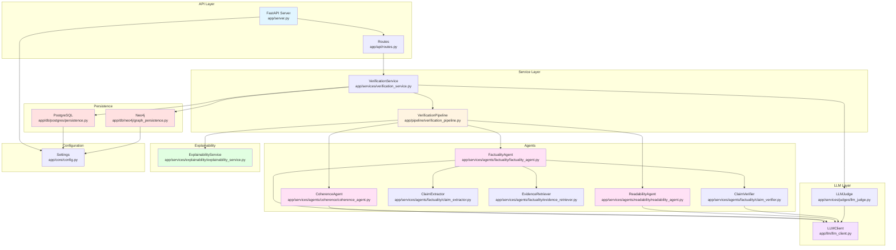

# Systemarchitektur & Design – Vollständige Dokumentation

<!-- markdownlint-disable MD013 MD033 -->

**Datum:** 2026-01-26  
**Zweck:** Architektur-Dokumentation für Kapitel 4 (Systemdesign & Architektur)

---

## A) Architektur-Zusammenfassung (25 Bulletpoints)

1. **Einstiegspunkt:** FastAPI-App (`app/server.py:20-21`) mit Lifespan-Management für Neo4j-Connection-Cleanup
1. **API-Schicht:** REST-Endpoint `/verify` (`app/api/routes.py:20-37`) nimmt `VerifyRequest` entgegen, gibt `VerifyResponse` zurück
1. **Orchestrierung:** `VerificationService` (`app/services/verification_service.py:31-171`) orchestriert Pipeline + Persistenz + optional LLM-as-a-Judge
1. **Pipeline:** `VerificationPipeline` (`app/pipeline/verification_pipeline.py:29-61`) führt drei Agenten sequenziell aus, berechnet Overall-Score, ruft Explainability auf
1. **Factuality Agent:** Satzbasierte Claim-Extraktion (`app/services/agents/factuality/claim_extractor.py:40`), Evidence-Retrieval (`app/services/agents/factuality/evidence_retriever.py:45`), Claim-Verifikation mit Evidence-Gate (`app/services/agents/factuality/claim_verifier.py:75`), Score-Aggregation (correct=1.0, incorrect=0.0, uncertain=0.5)
1. **Coherence Agent:** LLM-basierte Bewertung (`app/services/agents/coherence/coherence_verifier.py:42`), Issue-Erkennung (LOGICAL_INCONSISTENCY, CONTRADICTION, REDUNDANCY, ORDERING), Score direkt vom LLM (0-1)
1. **Readability Agent:** LLM-basierte Bewertung (`app/services/agents/readability/readability_verifier.py:72`), Issue-Erkennung (LONG_SENTENCE, COMPLEX_NESTING, PUNCTUATION_OVERLOAD), Score direkt vom LLM (0-1)
1. **Explainability Service:** Transformiert Agent-Outputs (`app/services/explainability/explainability_service.py:76-690`) in strukturierten Report (Normalisierung, Deduplizierung, Ranking, Executive Summary)
1. **Evidence-Gate:** `LLMClaimVerifier._apply_gate()` (`app/services/agents/factuality/claim_verifier.py:200-250`) erlaubt "incorrect" nur mit `evidence_found=True`, downgradet zu "uncertain" bei fehlender Evidence
1. **Evidence-Retrieval:** Sliding-Window-Passagen (`app/services/agents/factuality/evidence_retriever.py:45-171`), Jaccard-Similarity-Scoring, Boost für Zahlen/Entities
1. **Score-Normalisierung:** Factuality: satzweise Aggregation (correct=1.0, incorrect=0.0, uncertain=0.5), Coherence/Readability: direkt vom LLM (0-1), Overall: arithmetisches Mittel
1. **Datenmodelle:** Pydantic-Modelle (`app/models/pydantic.py`) für API (VerifyRequest/VerifyResponse), Pipeline (PipelineResult, AgentResult), Explainability (ExplainabilityResult, Finding, Span)
1. **PostgreSQL-Persistenz:** Schema (`app/db/postgres/schema.sql`) mit Tabellen: datasets, articles, summaries, runs, verification_results, explanations, explainability_reports, run_errors
1. **Neo4j-Persistenz:** Graph-Modell (`app/db/neo4j/graph_persistence.py:51-152`) mit Nodes (Article, Summary, Run, Metric, IssueSpan/Error), Relations (HAS_SUMMARY, EVALUATES, HAS_METRIC, HAS_ISSUE_SPAN)
1. **LLM-Client:** Abstraktion (`app/llm/llm_client.py`) mit Implementierungen: OpenAIClient (`app/llm/openai_client.py`), FakeLLMClient (`app/llm/fake_client.py`) für Tests
1. **LLM-as-a-Judge:** Generisches Modul (`app/services/judges/llm_judge.py:29-291`) für Factuality/Coherence/Readability, Committee-Judgements (n=3), Aggregation (mean/median/majority)
1. **Konfiguration:** Pydantic BaseSettings (`app/core/config.py:4-26`) lädt ENV-Variablen (DATABASE_URL, NEO4J_URL, OPENAI_API_KEY)
1. **Deployment:** Docker Compose (`docker-compose.yml`) orchestriert 4 Services: api (FastAPI), db (PostgreSQL), neo4j, ui (Streamlit)
1. **Dockerfile:** Multi-Stage Build (`Dockerfile:1-23`), Python 3.11-slim, CMD: `uvicorn app.server:app`
1. **Session-Management:** SQLAlchemy Session-Factory (`app/db/postgres/session.py:1-23`) mit Dependency Injection für FastAPI
1. **IssueSpans:** Kanonisches Format (`app/models/pydantic.py:8-30`) mit start_char, end_char, message, severity, issue_type, verdict, evidence_found
1. **Claims:** Strukturierte Claims (`app/services/agents/factuality/claim_models.py:16-50`) mit label, confidence, error_type, evidence_spans_structured, evidence_quote
1. **CoherenceIssues:** Strukturierte Issues (`app/services/agents/coherence/coherence_models.py:6-19`) mit type, severity, summary_span, comment
1. **ReadabilityIssues:** Strukturierte Issues (`app/services/agents/readability/readability_models.py:27-43`) mit type, severity, summary_span, comment, metric
1. **Explainability-Modelle:** Finding (`app/services/explainability/explainability_models.py:51-61`), TopSpan, ExplainabilityStats, ExplainabilityResult mit Executive Summary

---

## B) Komponenten-Tabelle

| Komponente | Verantwortung | Zentrale Dateien | Wichtigste Modelle |
|---|---|---|---|
| **API-Schicht** | HTTP-Endpoints, Request/Response-Validierung | `app/api/routes.py:1-45`, `app/server.py:1-32` | `VerifyRequest`, `VerifyResponse` (`app/models/pydantic.py:57-108`) |
| **VerificationService** | Orchestriert Pipeline + Persistenz, speichert Artikel/Summary | `app/services/verification_service.py:31-171` | `PipelineResult` (`app/models/pydantic.py:75-90`) |
| **VerificationPipeline** | Führt drei Agenten sequenziell aus, berechnet Overall-Score, ruft Explainability auf | `app/pipeline/verification_pipeline.py:29-61` | `AgentResult` (`app/models/pydantic.py:33-54`) |
| **FactualityAgent** | Satzbasierte Claim-Extraktion, Evidence-Retrieval, Claim-Verifikation, Score-Aggregation | `app/services/agents/factuality/factuality_agent.py:24-633` | `Claim` (`app/services/agents/factuality/claim_models.py:16-50`), `IssueSpan` (`app/models/pydantic.py:8-30`) |
| **CoherenceAgent** | LLM-basierte Bewertung der logischen Konsistenz, Issue-Erkennung | `app/services/agents/coherence/coherence_agent.py:15-169` | `CoherenceIssue` (`app/services/agents/coherence/coherence_models.py:6-19`), `AgentResult` |
| **ReadabilityAgent** | LLM-basierte Bewertung der Lesbarkeit, Issue-Erkennung | `app/services/agents/readability/readability_agent.py:27-284` | `ReadabilityIssue` (`app/services/agents/readability/readability_models.py:27-43`), `AgentResult` |
| **ExplainabilityService** | Transformiert Agent-Outputs in strukturierten Report (Normalisierung, Deduplizierung, Ranking) | `app/services/explainability/explainability_service.py:76-690` | `ExplainabilityResult`, `Finding`, `Span`, `TopSpan` (`app/services/explainability/explainability_models.py`) |
| **LLMClaimVerifier** | Verifiziert Claims gegen Artikel mit Evidence-Gate-Logik | `app/services/agents/factuality/claim_verifier.py:35-817` | `Claim`, `EvidenceSpan`, `GateDecision` (`app/services/agents/factuality/verifier_models.py`) |
| **EvidenceRetriever** | Retrieviert relevante Passagen aus Artikel (Sliding-Window, Jaccard-Similarity) | `app/services/agents/factuality/evidence_retriever.py:18-251` | - |
| **PostgreSQL-Persistenz** | Speichert Artikel, Summaries, Runs, Verification-Results, Explanations | `app/db/postgres/persistence.py:33-271`, `app/db/postgres/schema.sql` | SQL-Tabellen: `articles`, `summaries`, `runs`, `verification_results`, `explanations`, `explainability_reports`, `run_errors` |
| **Neo4j-Persistenz** | Speichert Verifikations-Runs als Graph (Nodes: Article, Summary, Run, Metric, IssueSpan/Error) | `app/db/neo4j/graph_persistence.py:12-152` | Cypher-Queries mit Nodes/Relations |
| **LLM-Client** | Abstraktion für LLM-Aufrufe (OpenAI-Implementierung) | `app/llm/openai_client.py`, `app/llm/llm_client.py` | `LLMClient`-Interface |
| **LLM-as-a-Judge** | Generisches Judge-Modul für Factuality/Coherence/Readability | `app/services/judges/llm_judge.py:29-291` | `JudgeResult`, `JudgeOutput`, `CommitteeStats` (`app/models/pydantic.py:116-153`) |
| **Konfiguration** | Lädt ENV-Variablen (DATABASE_URL, NEO4J_URL, etc.) | `app/core/config.py:4-26` | `Settings` (Pydantic BaseSettings) |
| **Session-Management** | SQLAlchemy Session-Factory mit Dependency Injection | `app/db/postgres/session.py:1-23` | `SessionLocal` (sessionmaker) |

---

## C) API-Überblick

| Route | Zweck | Input-Model | Output-Model |
|---|---|---|---|
| `POST /verify` | Startet Verifikations-Pipeline für Artikel + Summary | `VerifyRequest` (`app/models/pydantic.py:57-72`): `article_text`, `summary_text`, `dataset`, `llm_model`, `meta`, `run_llm_judge`, `judge_mode`, `judge_n`, `judge_temperature`, `judge_aggregation` | `VerifyResponse` (`app/models/pydantic.py:93-108`): `run_id`, `overall_score`, `factuality`, `coherence`, `readability`, `explainability`, `judge`, `judge_error`, `judge_available` |
| `GET /health` | Health-Check | - | `{"status": "ok"}` |
| `GET /db-check` | Prüft DB-Verbindung | - | `{"db_ok": bool}` |
| `GET /` | Root-Endpoint | - | `{"message": "Verification API running"}` |

---

## D) Datenmodell-Überblick

### D.1 PostgreSQL (Relational)

**Tabellen:**

1. **datasets** (`app/db/postgres/schema.sql:37-44`)
    - `id` (SERIAL PRIMARY KEY)
    - `name` (TEXT NOT NULL)
    - `split`, `description`, `source_url`, `created_at`

1. **articles** (`app/db/postgres/schema.sql:47-55`)
    - `id` (SERIAL PRIMARY KEY)
    - `dataset_id` (INT REFERENCES datasets(id))
    - `external_id`, `title`, `text` (TEXT NOT NULL)
    - `metadata` (JSONB), `created_at`

1. **summaries** (`app/db/postgres/schema.sql:58-66`)
    - `id` (SERIAL PRIMARY KEY)
    - `article_id` (INT NOT NULL REFERENCES articles(id) ON DELETE CASCADE)
    - `source` (summary_source ENUM: 'reference', 'llm', 'baseline', 'other')
    - `text` (TEXT NOT NULL)
    - `llm_model`, `prompt_version`, `created_at`

1. **runs** (`app/db/postgres/schema.sql:69-78`)
    - `id` (SERIAL PRIMARY KEY)
    - `article_id`, `summary_id` (INT NOT NULL, REFERENCES)
    - `run_type` (run_type ENUM: 'verification', 'metric_baseline')
    - `config` (JSONB)
    - `status` (run_status ENUM: 'pending', 'running', 'success', 'failed')
    - `started_at`, `finished_at`

1. **verification_results** (`app/db/postgres/schema.sql:81-95`)
    - `id` (SERIAL PRIMARY KEY)
    - `run_id` (INT NOT NULL REFERENCES runs(id) ON DELETE CASCADE)
    - `dimension` (verification_dimension ENUM: 'factuality', 'coherence', 'fluency', 'readability', 'overall')
    - _Hinweis:_ `fluency` ist im Schema definiert, wird aktuell aber nicht befüllt (nur 'factuality', 'coherence', 'readability', 'overall' werden verwendet)
    - `score` (DOUBLE PRECISION NOT NULL)
    - `label` (TEXT)
    - `explanation` (TEXT)
    - `issue_spans` (JSONB NOT NULL DEFAULT '[]'::jsonb)
    - `details` (JSONB)
    - `created_at`
    - UNIQUE (run_id, dimension)

1. **explanations** (`app/db/postgres/schema.sql:110-118`)
    - `id` (SERIAL PRIMARY KEY)
    - `run_id` (INT NOT NULL REFERENCES runs(id) ON DELETE CASCADE)
    - `verification_result_id` (INT REFERENCES verification_results(id) ON DELETE SET NULL)
    - `agent_name` (TEXT)
    - `explanation` (TEXT NOT NULL)
    - `raw_response` (JSONB)
    - `created_at`

1. **explainability_reports** (`app/db/postgres/schema.sql:120-129`)
    - `id` (SERIAL PRIMARY KEY)
    - `run_id` (INTEGER NOT NULL REFERENCES runs(id) ON DELETE CASCADE)
    - `version` (TEXT NOT NULL)
    - `report_json` (JSONB NOT NULL)
    - `created_at`
    - UNIQUE (run_id, version)

1. **run_errors** (`app/db/postgres/schema.sql:99-106`)
    - `id` (SERIAL PRIMARY KEY)
    - `run_id` (INT REFERENCES runs(id) ON DELETE CASCADE)
    - `stage` (TEXT)
    - `message` (TEXT NOT NULL)
    - `traceback` (TEXT)
    - `created_at`

**Relationen:**

- `articles.dataset_id` → `datasets.id`
- `summaries.article_id` → `articles.id` (CASCADE)
- `runs.article_id` → `articles.id` (CASCADE)
- `runs.summary_id` → `summaries.id` (CASCADE)
- `verification_results.run_id` → `runs.id` (CASCADE)
- `explanations.run_id` → `runs.id` (CASCADE)
- `explanations.verification_result_id` → `verification_results.id` (SET NULL)
- `explainability_reports.run_id` → `runs.id` (CASCADE)
- `run_errors.run_id` → `runs.id` (CASCADE)

### D.2 Neo4j (Graph)

**Node-Labels:**

1. **Article** (`app/db/neo4j/graph_persistence.py:64`)
    - Properties: `id` (int/string)

1. **Summary** (`app/db/neo4j/graph_persistence.py:65`)
    - Properties: `id` (int/string)

1. **Run** (`app/db/neo4j/graph_persistence.py:75`)
    - Properties: `id` (int/string), `run_id` (int/string)

1. **Metric** (`app/db/neo4j/graph_persistence.py:90`)
    - Properties: `run_id`, `summary_id`, `dimension` (string: 'factuality', 'coherence', 'readability', 'overall'), `score` (float)

1. **IssueSpan / Error** (`app/db/neo4j/graph_persistence.py:113`)
    - Dual-Label: `IssueSpan:Error` (für Backward Compatibility)
    - Properties: `run_id`, `summary_id`, `dimension`, `span_index` (int), `message` (string), `severity` (string: 'low', 'medium', 'high'), `start_char` (int/null), `end_char` (int/null)

**Relation-Types:**

1. **HAS_SUMMARY** (`app/db/neo4j/graph_persistence.py:66`)
    - `(Article)-[:HAS_SUMMARY]->(Summary)`

1. **EVALUATES** (`app/db/neo4j/graph_persistence.py:79`)
    - `(Run)-[:EVALUATES]->(Summary)`

1. **HAS_METRIC** (`app/db/neo4j/graph_persistence.py:92`)
    - `(Summary)-[:HAS_METRIC]->(Metric)`

1. **HAS_ISSUE_SPAN** (`app/db/neo4j/graph_persistence.py:124`)
    - `(Metric)-[:HAS_ISSUE_SPAN]->(IssueSpan)`

---

## E) End-to-End Datenfluss (12 Schritte)

1. **HTTP-Request:** Client sendet `POST /verify` mit `VerifyRequest` → `app/api/routes.py:20-37`
1. **Service-Orchestrierung:** `VerificationService.verify()` (`app/services/verification_service.py:49-171`) empfängt Request + DB-Session
1. **Persistenz (Artikel/Summary):** `store_article_and_summary()` (`app/db/postgres/persistence.py:33-96`) speichert Artikel + Summary in PostgreSQL, gibt `(article_id, summary_id)` zurück
1. **Pipeline-Ausführung:** `VerificationPipeline.run()` (`app/pipeline/verification_pipeline.py:42-61`) wird aufgerufen
1. **Factuality Agent:** `FactualityAgent.run()` (`app/services/agents/factuality/factuality_agent.py:99-323`)
    - Satz-Splitting
    - Claim-Extraktion (`LLMClaimExtractor.extract_claims()`)
    - Evidence-Retrieval (`EvidenceRetriever.retrieve()`)
    - Claim-Verifikation (`LLMClaimVerifier.verify()` mit Evidence-Gate)
    - Score-Aggregation (satzweise)
    - IssueSpan-Generierung
1. **Coherence Agent:** `CoherenceAgent.run()` (`app/services/agents/coherence/coherence_agent.py:69-125`)
    - LLM-basierte Bewertung (`LLMCoherenceEvaluator.evaluate()`)
    - Issue-Erkennung (CoherenceIssue-Liste)
    - IssueSpan-Generierung
1. **Readability Agent:** `ReadabilityAgent.run()` (`app/services/agents/readability/readability_agent.py:82-141`)
    - LLM-basierte Bewertung (`LLMReadabilityEvaluator.evaluate()`)
    - Issue-Erkennung (ReadabilityIssue-Liste)
    - IssueSpan-Generierung
1. **Overall-Score:** Arithmetisches Mittel der drei Agent-Scores (`app/pipeline/verification_pipeline.py:47`)
1. **Explainability:** `ExplainabilityService.build()` (`app/services/explainability/explainability_service.py:76-690`)
    - Normalisierung (Agent-Outputs → Findings)
    - Deduplizierung & Clustering
    - Ranking (Severity × Dimension-Gewichtung)
    - Executive Summary
    - Top-Spans + Stats
1. **Optional: LLM-as-a-Judge:** `LLMJudge.judge()` (`app/services/judges/llm_judge.py:50-291`) falls `run_llm_judge=True`
1. **Persistenz (Run + Ergebnisse):** `store_verification_run()` (`app/db/postgres/persistence.py:102-271`)
    - Speichert Run in `runs`
    - Speichert Verification-Results in `verification_results` (factuality, coherence, readability, overall)
    - Speichert Explanations in `explanations`
    - Speichert Explainability-Report in `explainability_reports`
    - Best-Effort: `write_verification_graph()` (`app/db/neo4j/graph_persistence.py:12-49`) schreibt Graph nach Neo4j
1. **HTTP-Response:** `VerifyResponse` mit `run_id`, Scores, Explainability, Judge-Daten → Client

---

## F) Mermaid Component Diagram

---

## G) Wichtige Implementierungsdetails

### G.1 Evidence-Gate (Factuality)

**Implementierung:** `LLMClaimVerifier._apply_gate()` (`app/services/agents/factuality/claim_verifier.py:200-250`)

**Logik:**

- `label == "incorrect"` ohne `evidence_found == True` → Downgrade zu `"uncertain"`, Confidence clamp auf 0.5
- `label == "correct"` ohne Evidence (wenn `require_evidence_for_correct=True`) → Downgrade zu `"uncertain"`, Confidence clamp auf 0.55
- Coverage-Fail (Evidence-Quote deckt Claim nicht ab) → Confidence clamp, Label bleibt `"incorrect"` (kein Downgrade)

**Zweck:** Reduziert False Positives durch harte Evidence-Anforderung für "incorrect"-Labels.

### G.2 Score-Berechnung

**Factuality:** Satzweise Aggregation (`app/services/agents/factuality/factuality_agent.py:327-633`)

- `correct` = 1.0
- `incorrect` = 0.0
- `uncertain` = 0.5 (neutral gewichtet)
- Gesamtscore = Durchschnitt über alle Sätze

**Coherence/Readability:** Direkt vom LLM (`app/services/agents/coherence/coherence_verifier.py:42`, `app/services/agents/readability/readability_verifier.py:72`)

- LLM gibt Score 0-1 zurück
- Keine weitere Normalisierung

**Overall:** Arithmetisches Mittel (`app/pipeline/verification_pipeline.py:47`)

- `overall_score = (factuality.score + coherence.score + readability.score) / 3.0`

### G.3 IssueSpan-Generierung

**Factuality:** `FactualityAgent._build_issue_spans_from_claims()` (`app/services/agents/factuality/factuality_agent.py:450-550`)

- Generiert IssueSpans aus Claims mit `label in ("incorrect", "uncertain")`
- Mapping von Claim-Text zu Summary-Char-Positionen
- `verdict` = "incorrect" oder "uncertain", `evidence_found` aus Claim

**Coherence:** `CoherenceAgent._build_error_spans()` (`app/services/agents/coherence/coherence_agent.py:142-169`)

- Generiert IssueSpans aus CoherenceIssues
- `issue_type` = CoherenceIssue.type

**Readability:** `ReadabilityAgent._build_issue_spans()` (`app/services/agents/readability/readability_agent.py:179-204`)

- Generiert IssueSpans aus ReadabilityIssues
- `issue_type` = ReadabilityIssue.type

### G.4 Explainability-Transformation

**Schritte** (`app/services/explainability/explainability_service.py:76-690`):

1. **Normalisierung:** Agent-Outputs → Findings (Dimension, Severity, Span, Message)
1. **Deduplizierung:** Überlappende Findings werden zusammengeführt (Char-Overlap > 50%)
1. **Clustering:** Findings mit ähnlichen Spans werden gruppiert
1. **Ranking:** `rank_score = severity_weight × dimension_weight × log(span_length)`
1. **Top-Spans:** Top-K Findings nach Rank-Score
1. **Executive Summary:** Regelbasierte Zusammenfassung aus Findings

---

## H) Deployment & Konfiguration

### H.1 Docker Compose

**Services** (`docker-compose.yml:1-92`):

- `api`: FastAPI-App (Port 8000)
- `db`: PostgreSQL 16 (Port 5433)
- `neo4j`: Neo4j 5 (Ports 7474, 7687)
- `ui`: Streamlit Dashboard (Port 8501)

**Volumes:** Persistente Daten für PostgreSQL und Neo4j

### H.2 Dockerfile

**Basis:** Python 3.11-slim (`Dockerfile:1-23`)
**CMD:** `uvicorn app.server:app --host 0.0.0.0 --port 8000`

### H.3 Environment Variables

**Konfiguration** (`app/core/config.py:4-26`):

- `DATABASE_URL`: PostgreSQL Connection String
- `NEO4J_URL`, `NEO4J_USER`, `NEO4J_PASSWORD`: Neo4j Connection
- `OPENAI_API_KEY`: Für LLM-Calls (via ENV, nicht in Config)
- `ENABLE_LLM_JUDGE`: Aktiviert LLM-as-a-Judge (default: "false")
- `TEST_MODE`: Deaktiviert DB-Zugriffe (default: "0")

---

## I) Nicht gefundene / Unklare Aspekte

1. **Makefile:** NICHT GEFUNDEN (gesucht: `glob_file_search("Makefile")`)
1. **Logging-Konfiguration:** Logging wird verwendet (`logging.getLogger(__name__)`), aber keine zentrale Konfigurationsdatei gefunden
1. **Dashboard (Streamlit):** Datei existiert (`app/dashboard/streamlit_app.py`), aber Inhalt ist leer (0 Zeilen)
1. **YAML Run-Configs:** NICHT GEFUNDEN (gesucht: `glob_file_search("*.yaml")`, `glob_file_search("*.yml")` in `scripts/` oder `configs/`)
1. **Evaluation Scripts:** Evaluation-Skripte existieren (`scripts/eval_*.py`), aber keine zentrale Config-Struktur für Datasets/Splits/Limits gefunden

---

## J) Code-Evidenz-Referenzen

**Einstiegspunkt:**

- `app/server.py:20-21` (FastAPI-App)
- `app/server.py:21` (Router-Inclusion)

**API:**

- `app/api/routes.py:20-37` (POST /verify)
- `app/api/routes.py:14-16` (GET /health)
- `app/api/routes.py:41-44` (GET /db-check)

**Pipeline:**

- `app/pipeline/verification_pipeline.py:29-61` (VerificationPipeline)
- `app/services/verification_service.py:31-171` (VerificationService)

**Agenten:**

- `app/services/agents/factuality/factuality_agent.py:24-633` (FactualityAgent)
- `app/services/agents/coherence/coherence_agent.py:15-169` (CoherenceAgent)
- `app/services/agents/readability/readability_agent.py:27-284` (ReadabilityAgent)

**Explainability:**

- `app/services/explainability/explainability_service.py:76-690` (ExplainabilityService)

**Persistence:**

- `app/db/postgres/persistence.py:33-271` (PostgreSQL)
- `app/db/neo4j/graph_persistence.py:12-152` (Neo4j)

**LLM:**

- `app/llm/openai_client.py` (OpenAIClient)
- `app/services/judges/llm_judge.py:29-291` (LLMJudge)

---

**Ende der Dokumentation**
