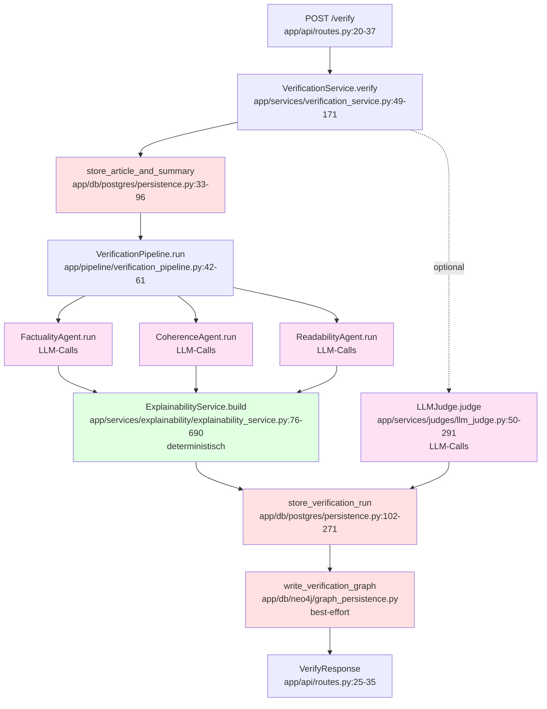

# Kapitel 5 Ergänzung: Verifikationspipeline-Abbildung und Prompt Design

## TEIL A: Verifikationspipeline-Abbildung

### Mermaid-Flowchart

### Was zeigt die Abbildung?

Die Abbildung visualisiert den End-to-End-Datenfluss von einem HTTP-Request bis zur Response. Der Flow beginnt mit dem FastAPI-Endpoint `/verify` (`app/api/routes.py:20-37`), der den Request an den `VerificationService` weiterleitet. Der Service speichert zunächst Artikel und Summary in PostgreSQL (`store_article_and_summary`, `app/db/postgres/persistence.py:33-96`), führt dann die Verifikationspipeline aus, die die drei Agenten sequenziell aufruft. **LLM-Calls passieren in den Agenten** (Factuality, Coherence, Readability) sowie optional im LLM-as-a-Judge-Modul. Nach der Agent-Ausführung transformiert der Explainability-Service die Agent-Outputs **deterministisch und regelbasiert** (ohne LLM-Calls) in einen strukturierten Report. Abschließend werden Run und Ergebnisse in PostgreSQL persistiert (`store_verification_run`, `app/db/postgres/persistence.py:102-271`), und optional wird ein Graph nach Neo4j geschrieben (`write_verification_graph`, best-effort). Die Response enthält alle Scores, IssueSpans und den Explainability-Report.

## TEIL B: Prompt Design

### 5.6 Prompt Design und LLM-Konfiguration

Das System verwendet strukturierte Prompts für alle LLM-basierten Komponenten (Agenten und LLM-as-a-Judge). Jeder Prompt erzwingt striktes JSON-Output mit festem Schema, um deterministische Parsing- und Validierungslogik zu ermöglichen. Die Prompt-Versionierung ermöglicht reproduzierbare Experimente, während `run_tag` für Cache-Identifikation und Run-Labeling verwendet wird.

#### Prompt-Architektur

**Claim-Extraction (Factuality):** Der `LLMClaimExtractor` (`app/services/agents/factuality/claim_extractor.py:163-205`) extrahiert atomare, faktische Claims aus Sätzen. Der Prompt fordert explizit, dass Claims als wörtliche Auszüge aus dem Satz stammen (Substring-Constraint), maximal 5 Claims pro Satz erlaubt sind und Meta-Aussagen über Lesbarkeit/Stil ignoriert werden. Das Output-Schema erwartet ein JSON-Objekt mit `claims: [{"text": "..."}]`. Der Parser validiert, dass jeder Claim tatsächlich ein Substring des ursprünglichen Satzes ist (`app/services/agents/factuality/claim_extractor.py:280-327`).

**Claim-Verification (Factuality):** Der `LLMClaimVerifier` (`app/services/agents/factuality/claim_verifier.py:448-502`) verifiziert Claims gegen Evidence-Passagen. Der Prompt unterscheidet zwei Modi: (1) Mit `evidence_context_list` (nummerierte Passagen) fordert er explizit die Auswahl einer Passage (`selected_evidence_index: 0..N` oder `-1`) und ein wörtliches Zitat (`evidence_quote` als Substring der Passage). (2) Ohne Evidence-Liste verwendet er einen einfacheren Kontext-basierten Prompt. Das Output-Schema erwartet `label` (correct/incorrect/uncertain), `confidence`, `error_type` (ENTITY/NUMBER/DATE/OTHER), `explanation`, `selected_evidence_index` und `evidence_quote`. Die Evidence-Validierung prüft, ob das Quote tatsächlich in der ausgewählten Passage vorkommt (`app/services/agents/factuality/claim_verifier.py:100-200`).

**Coherence-Prompt:** Der `LLMCoherenceEvaluator` (`app/services/agents/coherence/coherence_verifier.py:117-160`) verwendet einen Prompt, der explizit nur Kohärenz bewertet (nicht Lesbarkeit oder Faktentreue). Das Schema erwartet `score` (0.0-1.0), `explanation` und `issues` (maximal 8) mit `type` (LOGICAL_INCONSISTENCY, CONTRADICTION, REDUNDANCY, ORDERING, OTHER), `severity` (low/medium/high), `summary_span` (Substring-Constraint) und `comment`. Wenn `score < 0.7` und keine Issues geliefert werden, wird ein Fallback-Issue erzeugt (`app/services/agents/coherence/coherence_verifier.py:94-105`).

**Readability-Prompt:** Der `LLMReadabilityEvaluator` unterstützt zwei Prompt-Versionen (`app/services/agents/readability/readability_verifier.py:154-157`). Version `v1` (`app/services/agents/readability/readability_verifier.py:159-206`) erwartet `score` (0.0-1.0), `explanation` und `issues` mit `type` (LONG_SENTENCE, COMPLEX_NESTING, PUNCTUATION_OVERLOAD, HARD_TO_PARSE), `severity`, `summary_span` und optional `metric`/`metric_value`. Version `v2` (`app/services/agents/readability/readability_verifier.py:208-254`) verwendet eine Rubrik-basierte Bewertung mit 1-5 Integer-Score, der intern zu 0-1 normalisiert wird. Beide Versionen erzwingen, dass `summary_span` ein Substring der Summary ist.

**Judge-Prompts:** Das LLM-as-a-Judge-Modul (`app/services/judges/prompts.py`) stellt Prompt-Builder für alle drei Dimensionen bereit. Readability unterstützt `v1` (1-5 Rating) und `v2_float` (0.00-1.00 Score), Coherence unterstützt `v1` (1-5 Rating), Factuality unterstützt `v1` (1-5 Rating) und `v2_binary` (binary `error_present` mit `confidence`). Alle Judge-Prompts erzwingen striktes JSON-Output mit festem Schema (`app/services/judges/prompts.py:8-240`).

#### JSON-Parsing und Validierung

Alle Prompts werden mit striktem JSON-Parsing verarbeitet. Der Parser sucht nach dem ersten `{` und letzten `}` im LLM-Output und versucht, den dazwischenliegenden Text als JSON zu parsen (`app/services/agents/factuality/claim_extractor.py:207-213`, `app/services/agents/coherence/coherence_verifier.py:162-184`). Bei Parsing-Fehlern werden Fallbacks verwendet: Claim-Extraction gibt eine leere Liste zurück, Coherence/Readability verwenden Default-Scores (0.0) und leere Issue-Listen. Der LLM-Judge verwendet eine Retry-Logik mit Repair-Prompts bei fehlerhaftem JSON (`app/services/judges/llm_judge.py:163-201`).

#### Uncertainty-Policy und Evidence-Gate

Die Uncertainty-Policy ist zentral im Evidence-Gate implementiert (`app/services/agents/factuality/claim_verifier.py:200-250`). Das Gate erlaubt "incorrect"-Labels nur, wenn `evidence_found == True` ist. Fehlt Evidence für ein "incorrect"-Label, wird es zu "uncertain" downgraded und die Confidence auf maximal 0.5 geklemmt. Wenn `require_evidence_for_correct=True` gesetzt ist, werden auch "correct"-Labels ohne Evidence zu "uncertain" downgraded (Confidence clamp auf 0.55). Coverage-Fails (Evidence-Quote deckt Claim nicht ab) führen zu Confidence-Clamps, aber keinem Label-Downgrade. Diese Logik ist durch Unit-Tests abgesichert (`tests/unit/test_evidence_gate_refactored.py`).

#### LLM-Defaults und Konfiguration

Der `OpenAIClient` (`app/llm/openai_client.py:17-25`) verwendet zentrale Defaults: `temperature=0.0` (deterministisch), `max_tokens=800` (ausreichend für JSON-Responses). Das Modell wird beim Client-Initialisierung übergeben (standardmäßig `gpt-4o-mini`). Es gibt keine explizite `response_format`-Konfiguration für JSON-Mode; stattdessen wird JSON durch Prompt-Constraints erzwungen. Der LLM-Judge unterstützt Committee-Judgements (`n=3` default) mit Aggregation (mean/median/majority, `app/services/judges/llm_judge.py:29-143`).

#### Prompt-Versionierung und Reproduzierbarkeit

**Prompt-Versionierung:** Agent-Prompts werden über Parameter gesteuert: `ReadabilityAgent` akzeptiert `prompt_version` (v1/v2, `app/services/agents/readability/readability_agent.py:36-40`), `CoherenceAgent` verwendet intern `v1` (kein Parameter), `FactualityAgent` verwendet feste Prompts ohne Versionierung (Claim-Extraction und Claim-Verification haben jeweils einen festen Prompt). Judge-Prompts werden über `prompt_version` gesteuert (`app/services/judges/llm_judge.py:57-72`), mit Defaults pro Dimension (z.B. `v2_binary` für Factuality, `v1` für Coherence/Readability).

**Run-Tag vs. Prompt-Version:** In Evaluationsskripten wird zwischen `run_tag` (für Cache-Identifikation und Run-Labeling) und `prompt_version` (für echte Prompt-Versionierung) unterschieden (`scripts/run_m10_factuality.py:200-228`). Der `run_tag` wird im Cache-Key verwendet (`scripts/run_m10_factuality.py:154-170`), während `prompt_version` nur dann gesetzt wird, wenn tatsächlich verschiedene Prompt-Versionen existieren. Legacy-Mapping erlaubt `prompt_version` als Fallback für `run_tag`, mit Deprecation-Warnung.

**Caching:** LLM-Antworten werden deterministisch gecacht. Der Cache-Key basiert auf Artikel-Text, Summary-Text, Modell und `run_tag` (`scripts/run_m10_factuality.py:154-170`). Cache-Dateien werden als JSONL gespeichert (`results/evaluation/cache/`), um schnelle Re-Runs ohne erneute LLM-Calls zu ermöglichen.

**Seeds:** Evaluationsskripte verwenden `llm_seed=42` (default) für deterministische LLM-Antworten (`configs/m10_factuality_runs.yaml:14`). Der Seed wird jedoch nicht explizit an den OpenAI-Client übergeben, da `temperature=0.0` bereits Determinismus gewährleistet.

## Repo-Belegliste

- **Pipeline-Flow:** `app/api/routes.py:20-37` → `app/services/verification_service.py:49-171` → `app/db/postgres/persistence.py:33-96` → `app/pipeline/verification_pipeline.py:42-61` → Agenten → `app/services/explainability/explainability_service.py:76-690` → `app/db/postgres/persistence.py:102-271` → `app/db/neo4j/graph_persistence.py:12-49`
- **Claim-Extraction Prompt:** `app/services/agents/factuality/claim_extractor.py:163-205` (Prompt-Text), `app/services/agents/factuality/claim_extractor.py:207-258` (Parsing)
- **Claim-Verification Prompt:** `app/services/agents/factuality/claim_verifier.py:448-502` (Prompt-Text), `app/services/agents/factuality/claim_verifier.py:100-200` (Evidence-Validierung)
- **Coherence Prompt:** `app/services/agents/coherence/coherence_verifier.py:117-160` (Prompt-Text), `app/services/agents/coherence/coherence_verifier.py:162-184` (Parsing)
- **Readability Prompts:** `app/services/agents/readability/readability_verifier.py:159-206` (v1), `app/services/agents/readability/readability_verifier.py:208-254` (v2)
- **Judge Prompts:** `app/services/judges/prompts.py:8-240` (alle Dimensionen und Versionen)
- **Evidence-Gate:** `app/services/agents/factuality/claim_verifier.py:200-250` (Gate-Logik), `tests/unit/test_evidence_gate_refactored.py` (Tests)
- **LLM Defaults:** `app/llm/openai_client.py:17-25` (temperature=0.0, max_tokens=800)
- **Run-Tag vs Prompt-Version:** `scripts/run_m10_factuality.py:200-228` (Legacy-Mapping), `configs/m10_factuality_runs.yaml:15` (run_tag), `scripts/aggregate_factuality_runs.py:159-166` (Extraction)
- **Caching:** `scripts/run_m10_factuality.py:154-170` (Cache-Key-Generierung)
- **Seeds:** `configs/m10_factuality_runs.yaml:14` (llm_seed=42)

## Anhang: Prompt-Katalog (Übersicht)

| Prompt | Dimension | Versionen | Inputs | Output-Schema | Quelle |
|--------|-----------|-----------|--------|---------------|--------|
| Claim Extraction | Factuality | v1 (fest) | `sentence` | `{"claims": [{"text": "..."}]}` | `app/services/agents/factuality/claim_extractor.py:163-205` |
| Claim Verification | Factuality | v1 (fest) | `evidence_context_list`, `claim_text` | `{"label": "correct\|incorrect\|uncertain", "confidence": 0.0, "error_type": "ENTITY\|NUMBER\|DATE\|OTHER", "selected_evidence_index": int, "evidence_quote": str\|null}` | `app/services/agents/factuality/claim_verifier.py:448-502` |
| Coherence | Coherence | v1 (fest) | `article_text`, `summary_text` | `{"score": 0.0, "explanation": str, "issues": [{"type": "...", "severity": "...", "summary_span": str}]}` | `app/services/agents/coherence/coherence_verifier.py:117-160` |
| Readability | Readability | v1, v2 | `article_text`, `summary_text` | v1: `{"score": 0.0, "explanation": str, "issues": [...]}`, v2: `{"rating": 1-5, ...}` | `app/services/agents/readability/readability_verifier.py:159-206, 208-254` |
| Judge Readability | Readability | v1, v2_float | `summary_text`, `article_text` (optional) | v1: `{"rating": 1-5, "confidence": 0.0, "rationale": str}`, v2_float: `{"score": 0.00-1.00, ...}` | `app/services/judges/prompts.py:26-97` |
| Judge Coherence | Coherence | v1 | `summary_text`, `article_text` (optional) | `{"rating": 1-5, "confidence": 0.0, "rationale": str}` | `app/services/judges/prompts.py:116-145` |
| Judge Factuality | Factuality | v1, v2_binary | `summary_text`, `article_text` | v1: `{"rating": 1-5, ...}`, v2_binary: `{"error_present": bool, "confidence": 0.0, "rationale": str}` | `app/services/judges/prompts.py:166-239` |

## Offene Punkte / Nicht gefunden

- **Seed-Parameter im OpenAI-Client:** Der `OpenAIClient` übergibt keinen `seed`-Parameter an `chat.completions.create()`. Gesucht wurde in `app/llm/openai_client.py` und `app/llm/llm_client.py`. Möglicherweise wird Determinismus ausschließlich über `temperature=0.0` erreicht.
- **JSON-Mode (response_format):** Es wurde kein expliziter `response_format="json_object"` oder `tool_choice` gefunden. Gesucht wurde nach `response_format`, `json_mode`, `tool_call` in `app/`. JSON wird ausschließlich durch Prompt-Constraints erzwungen.
- **Repair-Prompts für Agenten:** Während der LLM-Judge Repair-Prompts bei fehlerhaftem JSON verwendet (`app/services/judges/llm_judge.py:163-201`), verwenden die Agenten (Factuality, Coherence, Readability) keine expliziten Repair-Prompts. Bei Parsing-Fehlern werden Fallbacks verwendet (leere Listen, Default-Scores).

